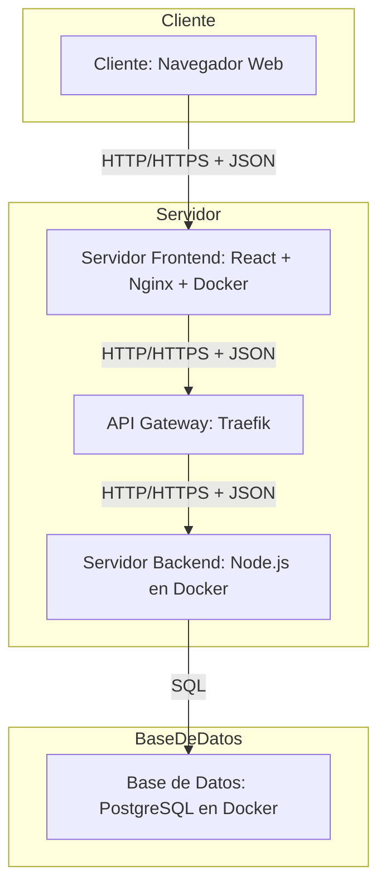

# Diagrama de Despliegue

1. **Descripción General**
   - Este diagrama ilustra la arquitectura de despliegue del sistema, mostrando cómo los diferentes componentes interactúan entre sí y con el entorno externo.
   - Incluye detalles sobre la infraestructura, como servidores y bases de datos.
  
2. **Componentes Principales**
3. **API Gateway**
   - **Descripción**: El API Gateway actúa como un punto de entrada único para todas las solicitudes del cliente. Se encarga de enrutar las solicitudes a los servicios correspondientes y gestionar la autenticación y autorización.
   - **Tecnología**: Traefik
   - **Responsabilidades**:
     - Enrutamiento de solicitudes
     - Autenticación y autorización
     - Balanceo de carga
     - Registro y monitoreo

4. **Servicios de Aplicación**
   - **Descripción**: Los servicios de aplicación son microservicios que implementan la lógica de negocio del sistema. Cada servicio es responsable de una funcionalidad específica.
   - **Tecnologías**: NestJS, Prisma
   - **Responsabilidades**:
     - Gestión de usuarios
     - Gestión de documentos
     - Transferencia de documentos
     - Interacción con la base de datos
     - Manejo de errores y excepciones
     - Validación de datos
     - Autenticación y autorización
     - Registro y monitoreo
     

5. **Base de Datos** 
   - **Descripción**: La base de datos almacena toda la información del sistema, incluyendo usuarios, documentos y registros de transferencia.
   - **Tecnología**: PostgreSQL
   - **Responsabilidades**:
     - Almacenamiento de datos
     - Consultas y transacciones
     - Seguridad y respaldo de datos
     - Integridad de datos

6. **Almacenamiento de Documentos**
   - **Descripción**: El almacenamiento de documentos es responsable de guardar los archivos subidos por los usuarios. Utiliza un sistema de archivos optimizado para servir archivos estáticos.
   - **Tecnología**: Nginx
   - **Responsabilidades**:
     - Almacenamiento y recuperación de archivos
     - Gestión de permisos de acceso
     - Optimización del rendimiento de entrega de archivos
     

