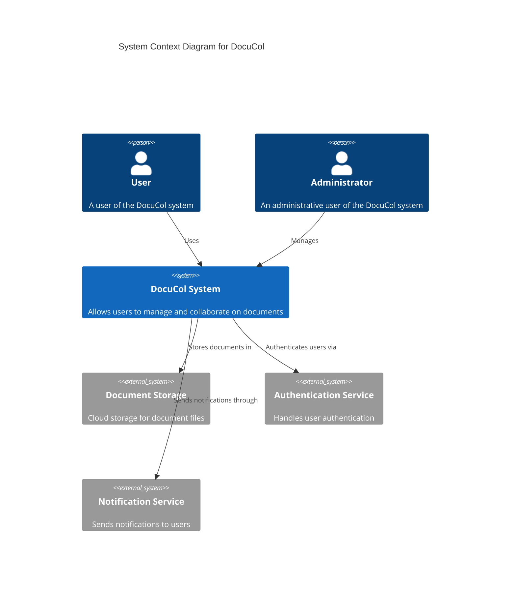

# DocuCol System Context (C1)

## Overview
This document describes the highest-level view of the DocuCol system, showing how it interacts with users and external systems.

## Context Diagram

## Key Components

- **Users**: People who use DocuCol to create, edit, and collaborate on documents
- **Administrators**: People who manage the DocuCol system, users, and permissions
- **DocuCol System**: The main application that provides document management capabilities
- **External Systems**:
  - Document Storage: Provides secure storage for all document files
  - Authentication Service: Handles user authentication and authorization
  - Notification Service: Manages sending notifications to users

## System Scope

DocuCol is responsible for:
- Document management and organization
- User collaboration features
- Access control and permissions
- Version tracking and history
- Document search and discovery

## Assumptions and Constraints

- Internet connectivity is required for all system functions
- The system must comply with relevant data protection regulations
- External authentication systems must be supported for enterprise customers

## References

- [Non-functional Requirements](./NFR.md)
- [Container Diagram](./C2-Containers.md)
