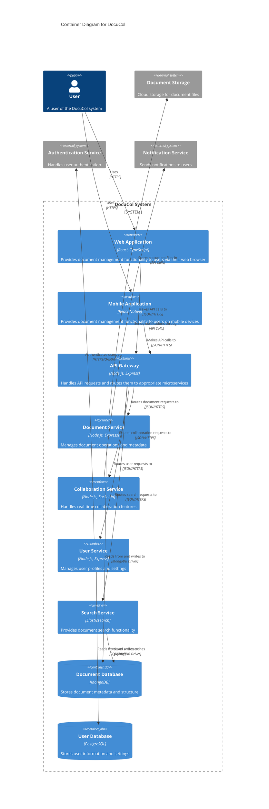

# DocuCol Container Diagram (C2)

## Overview
This document describes the high-level technology choices for DocuCol and how responsibilities are distributed across containers.

## Container Diagram

## Container Descriptions

### Frontend Applications
- **Web Application**: Browser-based interface built with React and TypeScript
- **Mobile Application**: Native mobile experience built with React Native

### Backend Services
- **API Gateway**: Entry point for all client requests, handles routing and basic validation
- **Document Service**: Core service managing document operations and metadata
- **Collaboration Service**: Enables real-time collaborative editing and commenting
- **User Service**: Handles user profile management and settings
- **Search Service**: Provides document search and discovery capabilities

### Data Stores
- **Document Database**: MongoDB database storing document metadata and structure
- **User Database**: PostgreSQL database storing user information and settings

## Communication Patterns

The system uses:
- RESTful APIs for most service-to-service communication
- WebSockets for real-time collaboration features
- Message queues for asynchronous processing

## References

- [System Context Diagram](./C1-SystemContext.md)
- [Component Diagrams](./C3-Components.md)
- [Deployment Architecture](./DeploymentDiagram.md)
