# DocuCol Container Diagram (C2)

## Overview
This document describes the high-level technology choices for DocuCol and how responsibilities are distributed across containers.

## Container Diagram

```mermaid
C4Container
    title Container Diagram for DocuCol

    Person(user, "User", "A user of the DocuCol system")
    Person(admin, "Administrator", "System administrator with extended privileges")
    
    System_Boundary(docuCol, "DocuCol System") {
        Container(webApp, "Web Application", "React, TypeScript", "Provides document management functionality to users via their web browser")
        Container(apiGateway, "API Gateway", "Traefik", "Routes API requests to appropriate microservices")
        
        Container(documentsApi, "Document API", "Node.js, Express", "Manages document operations and metadata")
        Container(usersApi, "Users API", "Node.js, Express", "Handles user authentication and profile management")
        Container(interopApi, "Interop API", "Node.js, Express", "Manages document transfers and external system integrations")
        Container(notificationsApi, "Notifications API", "Node.js, Express", "Handles email notifications and alerts")
        
        ContainerDb(documentDb, "Document Database", "PostgreSQL", "Stores document metadata and structure")
        ContainerDb(userDb, "User Database", "PostgreSQL", "Stores user information and authentication data")
        
        Container(objectStorage, "Object Storage", "MinIO", "Stores document files and attachments")
        Container(messageBroker, "Message Broker", "RabbitMQ", "Handles asynchronous communication between services")
        Container(cacheService, "Cache Service", "Redis", "Provides caching for frequently accessed data")
        Container(mailService, "Mail Service", "MailHog/SMTP", "Handles email delivery for notifications")
    }
    
    System_Ext(govCarpeta, "GOV Carpeta API", "External government document exchange system")
    
    Rel(user, webApp, "Uses", "HTTPS")
    Rel(admin, webApp, "Administers", "HTTPS")
    
    Rel(webApp, apiGateway, "Makes API calls to", "JSON/HTTPS")
    
    Rel(apiGateway, documentsApi, "Routes document requests to", "JSON/HTTPS")
    Rel(apiGateway, usersApi, "Routes user requests to", "JSON/HTTPS")
    Rel(apiGateway, interopApi, "Routes interoperability requests to", "JSON/HTTPS")
    Rel(apiGateway, notificationsApi, "Routes notification requests to", "JSON/HTTPS")
    Rel(apiGateway, objectStorage, "Routes storage requests to", "HTTP")
    
    Rel(documentsApi, documentDb, "Reads from and writes to", "SQL/JDBC")
    Rel(usersApi, userDb, "Reads from and writes to", "SQL/JDBC")
    
    Rel(documentsApi, objectStorage, "Stores and retrieves document files", "S3 API")
    Rel(documentsApi, messageBroker, "Publishes document events to", "AMQP")
    
    Rel(interopApi, documentsApi, "Requests document data from", "JSON/HTTP")
    Rel(interopApi, usersApi, "Validates users with", "JSON/HTTP")
    Rel(interopApi, govCarpeta, "Exchanges documents with", "REST API")
    Rel(interopApi, cacheService, "Caches transfer data in", "Redis Protocol")
    
    Rel(notificationsApi, messageBroker, "Consumes events from", "AMQP")
    Rel(notificationsApi, mailService, "Sends emails through", "SMTP")
```

## Container Descriptions

### Frontend Application
- **Web Application**: Browser-based interface built with React and TypeScript that provides the user interface for document management, user authentication, and system administration.

### API Gateway
- **Traefik API Gateway**: Routes client requests to appropriate backend services based on URL paths, handles load balancing, and provides service discovery.

### Backend Services
- **Document API**: Manages documents, including metadata, versioning, and file storage operations.
- **Users API**: Handles user authentication, authorization, and profile management.
- **Interop API**: Manages document transfers between users and integrates with external systems like GOV Carpeta.
- **Notifications API**: Processes system events and sends email notifications to users.

### Data Stores
- **Document Database**: PostgreSQL database storing document metadata, versioning information, and relationships.
- **User Database**: PostgreSQL database storing user profiles, credentials, and permissions.

### Infrastructure Services
- **Object Storage (MinIO)**: S3-compatible storage for document files and attachments.
- **Message Broker (RabbitMQ)**: Facilitates asynchronous event-based communication between services.
- **Cache Service (Redis)**: Provides caching and temporary data storage for improved performance.
- **Mail Service (MailHog/SMTP)**: Handles email delivery for system notifications and alerts.

## Communication Patterns

The system uses:
- RESTful APIs for synchronous service-to-service communication
- Message queues for asynchronous event-driven processing
- Object storage for document file management
- Caching for performance optimization

## Containerization Strategy

DocuCol follows a microservices containerization pattern with these key features:

### Build Context and Dockerfile Structure
- Each microservice has its own Dockerfile
- Build contexts are set to the root directory of each service
- This approach supports independent versioning and deployment

### Service Dependencies
- Dependencies between services are explicitly defined using health checks
- Services start in the correct order only when dependencies are healthy
- Creates a reliable startup sequence in the distributed system

### API Gateway Configuration
- Traefik serves as the API gateway with path-based routing
- Each service includes prefix handling middleware
- Supports both HTTP and HTTPS endpoints

### Path Handling
- Path prefix stripping middleware ensures clean service interfaces
- External routing paths are stripped before requests reach services
- Promotes better service isolation and independence

### Health Checks
- Database and message broker services include health checks
- Application services wait for data stores to be ready
- Improves overall system reliability and startup consistency

### Security Considerations
- API Gateway is the only component exposing ports to the host network
- Service-to-service communication occurs over internal Docker network
- Docker socket mounts are configured with read-only access

## References

- [System Context Diagram](./C1-SystemContext.md)
- [Component Diagrams](./C3-Components.md)
- [Deployment Architecture](./DeploymentDiagram.md)
