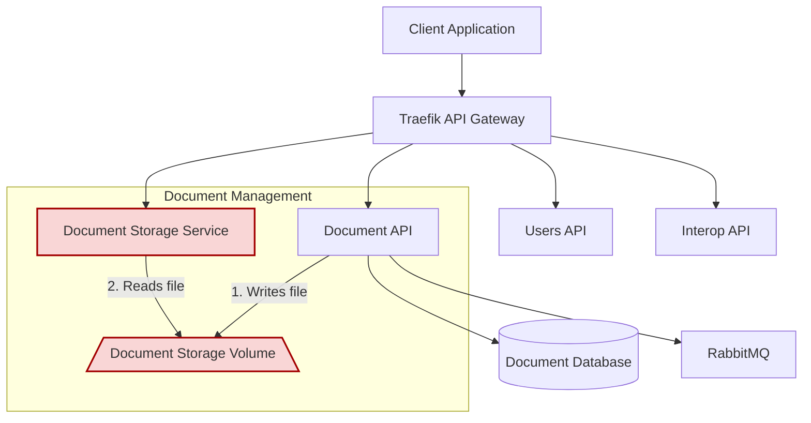
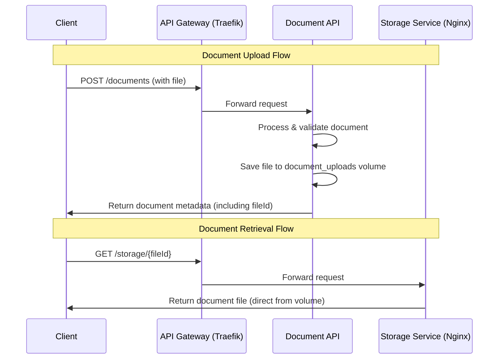
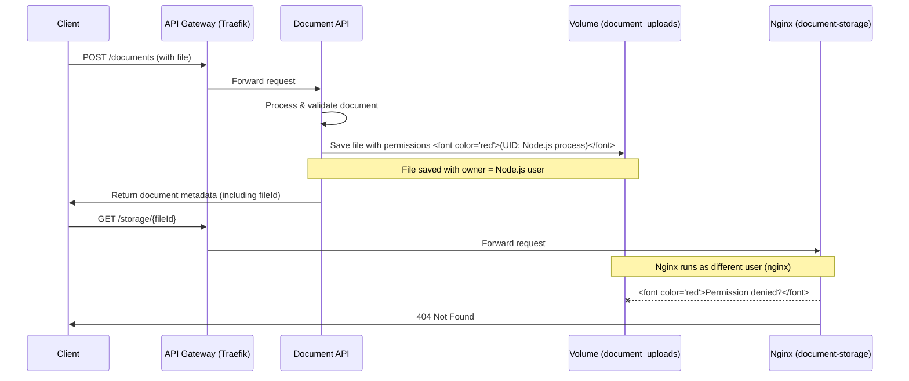

# API Gateway Architecture (C3)

## Overview

The API Gateway serves as the single entry point for all client applications, routing requests to the appropriate microservices.

### Component Diagram

### Deployment Flow Sequence Diagram

### File Access Flow Sequence Diagram

## Implementation Benefits

- **Zero-configuration service discovery** - Traefik automatically detects services and configures routes
- **Simple routing based on URL paths** - Uses path-based routing aligned with microservice architecture
- **Dashboard for monitoring and debugging** - Built-in visualization of routes and services
- **Easy SSL/TLS configuration** - Simple integration with Let's Encrypt for production
- **Docker-native integration** - Uses Docker labels for configuration

## Getting Started

1. Save the updated docker-compose.yml file
2. Start the services: `docker-compose up -d`
3. Access the Traefik dashboard at http://localhost:8080
4. Your services will be available at:
   - `/users` → Users API
   - `/documents` → Document API
   - `/gov-api` → Interop API

## Security Considerations for Production

For production deployment, you should:

- Disable the Traefik dashboard or secure it with authentication
- Enable HTTPS using Let's Encrypt or your own certificates
- Consider adding rate limiting middleware
- Implement proper network segmentation
- Secure the Docker socket

## Additional Documentation

For more advanced configuration including authentication, monitoring, and scaling, refer to the [Traefik documentation](https://doc.traefik.io/traefik/).

This implementation aligns with the DocuCol architectural principles while providing an easy-to-setup API gateway solution that integrates seamlessly with your Docker-based infrastructure.

## Conclusion
The API Gateway is a crucial component of the DocuCol architecture, providing a unified entry point for all client applications. By leveraging Traefik, we can achieve a robust, scalable, and easy-to-manage gateway that simplifies routing and enhances security.

This architecture allows for easy integration of new microservices and provides a clear separation of concerns, making it easier to manage and scale the system as needed.

The use of Docker and Traefik also ensures that the deployment process is streamlined, allowing for rapid development and testing cycles.

This document serves as a guide for implementing the API Gateway in the DocuCol architecture, providing a solid foundation for future enhancements and optimizations.
