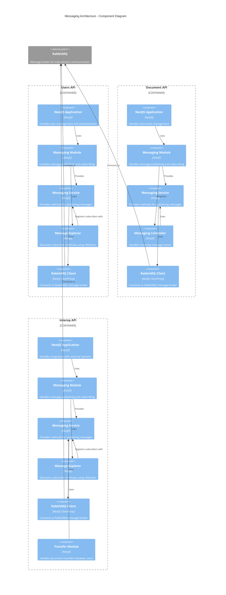
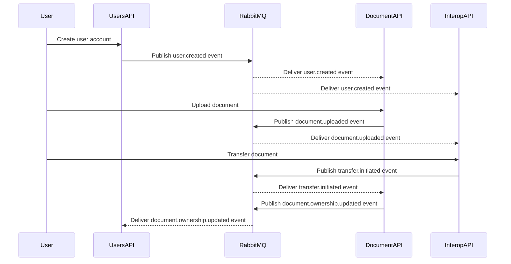

# Messaging Architecture (C3)

## Overview

The DocuCol system implements a robust messaging architecture using RabbitMQ to enable asynchronous communication between microservices. This design facilitates loose coupling, improved resilience, and scalability across the system.

## Component Diagram



## Message Flow Sequence Diagram



## Queue Architecture

Each microservice in DocuCol uses dedicated queues to ensure proper message delivery:

1. **Users API Queue**: 
   - Queue name: `{rabbitmq.queue}_users`
   - Handles user-related events like registration, updates, and profile changes

2. **Document API Queue**: 
   - Queue name: `{rabbitmq.queue}_documents`
   - Processes document-related events such as uploads, updates, and deletions

3. **Transfer Queue**: 
   - Queue name: `{rabbitmq.queue}_transfer`
   - Manages document transfer requests between users

4. **Interop API Queue**:
   - Queue name: `{rabbitmq.queue}`
   - Handles events related to external system integration

## Message Discovery and Registration

DocuCol implements a dynamic message subscription discovery system:

1. **Messaging Explorer**:
   - Uses NestJS's `DiscoveryService` to scan for methods decorated with `@RabbitSubscriber`
   - Automatically registers these methods as message handlers
   - Provides a declarative way to define message consumers

2. **Message Subscriber Decorator**:
   - Custom decorator (`@RabbitSubscriber`) marks methods as message subscribers
   - Defines which message patterns a method should handle
   - Stores metadata that's later discovered by the MessagingExplorer

## Connection Configuration

Services connect to RabbitMQ using a consistent configuration pattern:

```typescript
ClientsModule.registerAsync([
  {
    name: RABBIT_PROVIDER,
    imports: [ConfigModule],
    useFactory: (configService: ConfigService) => ({
      transport: Transport.RMQ,
      options: {
        urls: [configService.get<string>('rabbitmq.url') || 
              `amqp://${configService.get<string>('rabbitmq.username')}:${configService.get<string>('rabbitmq.password')}@${configService.get<string>('rabbitmq.host')}:${configService.get<number>('rabbitmq.port')}`],
        queue: `${configService.get<string>('rabbitmq.queue')}_[service-specific-suffix]`,
        queueOptions: {
          durable: true,
        },
      },
    }),
    inject: [ConfigService],
  },
]),
```

This pattern allows for consistent configuration across services while enabling service-specific queue names.

## Hybrid Application Structure

The Users API and Document API implement a hybrid application structure:

1. **HTTP API**: Handles synchronous REST requests from clients
2. **Microservice Listener**: Processes asynchronous messages from RabbitMQ

This dual-mode operation is configured in each service's `main.ts`:

```typescript
// Create HTTP application
const app = await NestFactory.create(AppModule);

// Connect microservice transport
app.connectMicroservice<MicroserviceOptions>({
  transport: Transport.RMQ,
  options: {
    urls: [rabbitMqUrl],
    queue: `${configService.get<string>('rabbitmq.queue')}_[service-name]`,
    queueOptions: { durable: true },
    noAck: false, // Explicit acknowledgment required
  },
});

// Start both HTTP and microservice modes
await app.startAllMicroservices();
await app.listen(port);
```

## Error Handling and Message Acknowledgment

The system implements reliable messaging with explicit acknowledgments:

1. **Message Acknowledgment**: 
   - `noAck: false` configuration requires explicit message acknowledgment
   - Prevents message loss when processing fails

2. **Error Handling**:
   - Services implement error handling around message processing
   - Failed messages can be retried or sent to dead-letter queues

## References

- [RabbitMQ Documentation](https://www.rabbitmq.com/documentation.html)
- [NestJS Microservices](https://docs.nestjs.com/microservices/basics)
- [ADR-002: Event-Driven Communication](./ADR/ADR-002-Event-Driven-Communication.md)
- [C2-Containers](./C2-Containers.md)
