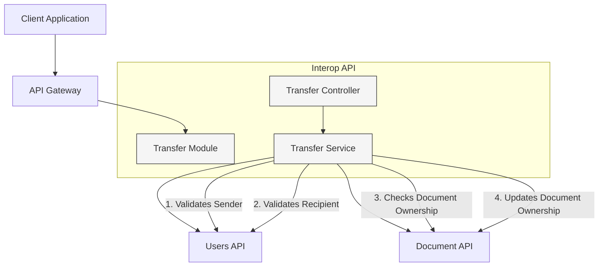
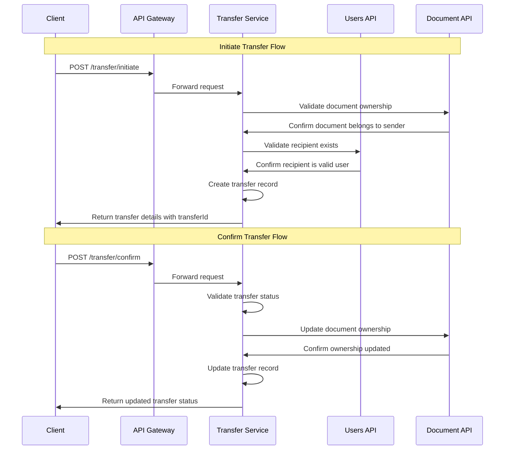

# Document Transfer Component (C3)

## Overview

The Document Transfer component provides functionality for securely transferring document ownership between users in the DocuCol system. This component is part of the Interop API and coordinates with other services to ensure secure and auditable transfers.

## Component Diagram

## Transfer Flow Sequence Diagram

## Component Responsibilities

### Transfer Controller
- Expose REST endpoints for transfer operations
- Validate incoming request data
- Handle request routing to the appropriate service methods
- Format responses to clients

### Transfer Service
- Implement business logic for transfer operations
- Coordinate with Users API to validate user information
- Coordinate with Document API to validate and update documents
- Maintain transfer state and audit information
- Enforce transfer security policies

## API Endpoints

## Data Models

### InitiateTransferDto
- **documentId**: ID of the document to transfer
- **fromUserId**: ID of the current document owner
- **toUserId**: ID of the intended recipient
- **reason**: Optional explanation for the transfer
- **metadata**: Optional additional information

### ConfirmTransferDto
- **transferId**: ID of the transfer to confirm
- **userId**: ID of the user confirming (must match the intended recipient)
- **accepted**: Boolean indicating acceptance or rejection
- **rejectionReason**: Optional explanation if rejected

### TransferResponseDto
- **transferId**: Unique identifier for the transfer
- **documentId**: ID of the transferred document
- **fromUserId**: Original owner
- **toUserId**: Intended recipient
- **status**: Current state ('initiated', 'confirmed', 'rejected', 'expired')
## Security Considerations

### Access Control:
- Only document owners can initiate transfers
- Only the intended recipient can confirm transfers

### Validation:
- Document existence and ownership verified before transfer
- User existence verified before transfer
- Transfer status checked before confirmation

### Audit Trail:
- All transfer activities are logged
- Complete history of ownership is maintained
## Error Handling

The Transfer component handles the following error scenarios:

- Document not found or not accessible
- User not authorized to transfer the document
- Recipient user not found
- Transfer not found when confirming
- User not authorized to confirm the transfer
## Future Enhancements

- **Expiration Policy**: Automatically expire transfers after a configurable period
- **Notifications**: Integrate with notification system to alert users about transfers
- **Batch Transfers**: Support transferring multiple documents in a single operation
## References

- ADR-011: Document Transfer Feature
- API Gateway Architecture
- Document API Component
Transfer already in a terminal state (confirmed/rejected)
## Implementation Summary

This implementation creates a complete transfer module within the Interop API, including:

1. **Module Definition**: Setting up the module structure with proper imports
2. **Data Transfer Objects**: Defining the request and response structures
3. **Service Implementation**: Business logic for initiating and confirming transfers
4. **Controller Implementation**: REST endpoints for transfer operations
5. **App Module Integration**: Including the new module in the application
6. **E2E Tests**: Testing the transfer flow end-to-end
7. **Architectural Documentation**: ADR and component documentation following C4 model

The module coordinates with the Document API and Users API to validate documents and users, and to update document ownership when transfers are confirmed.
