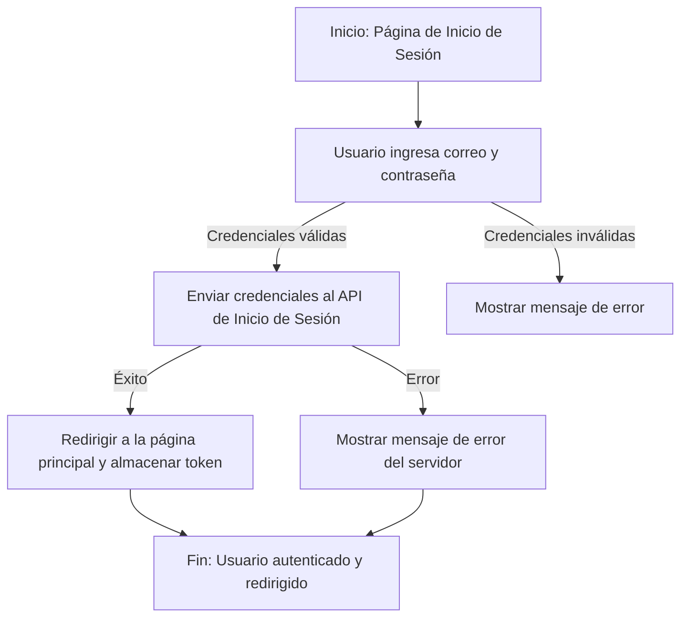
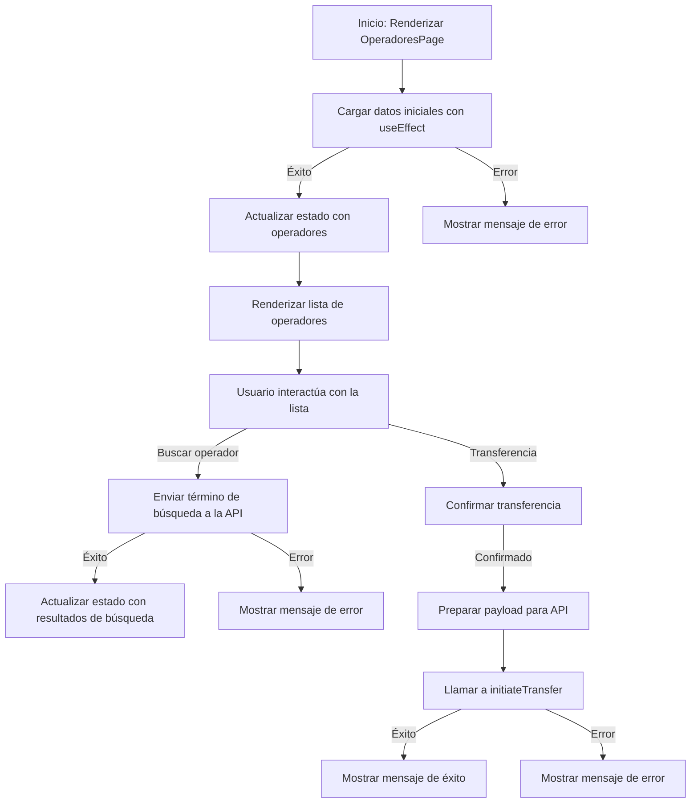
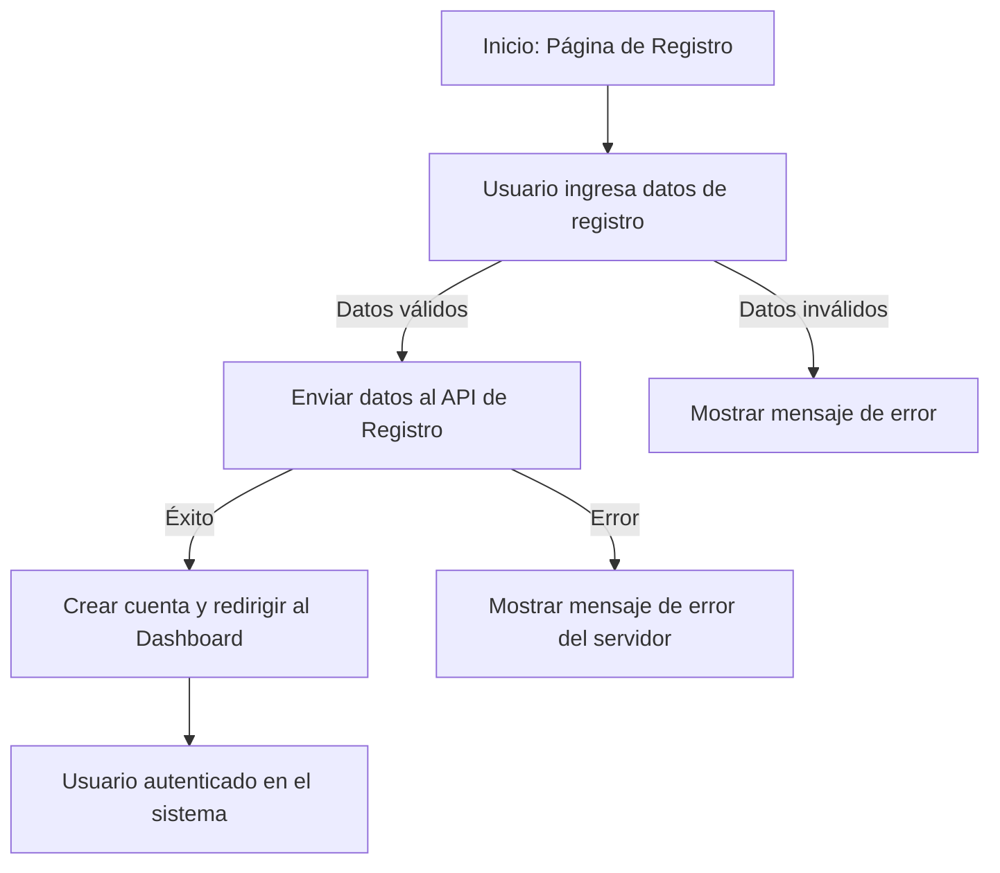
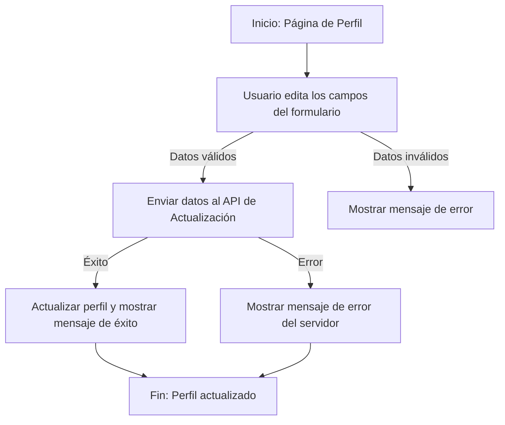
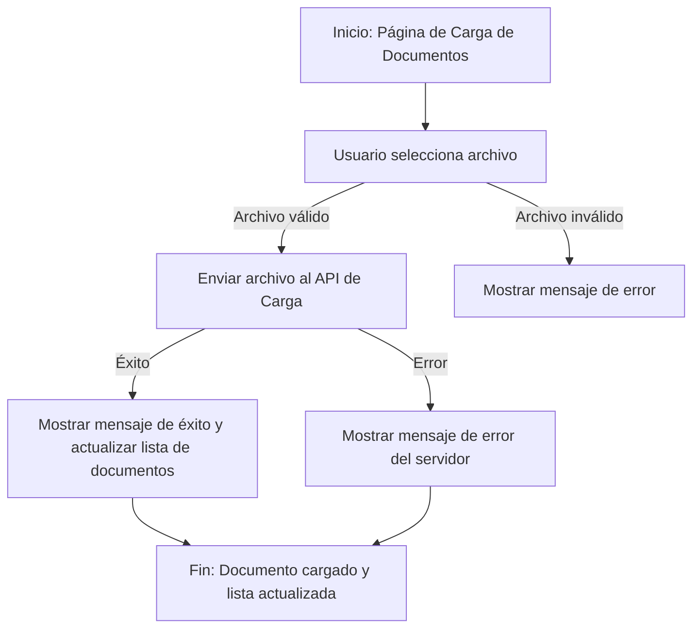
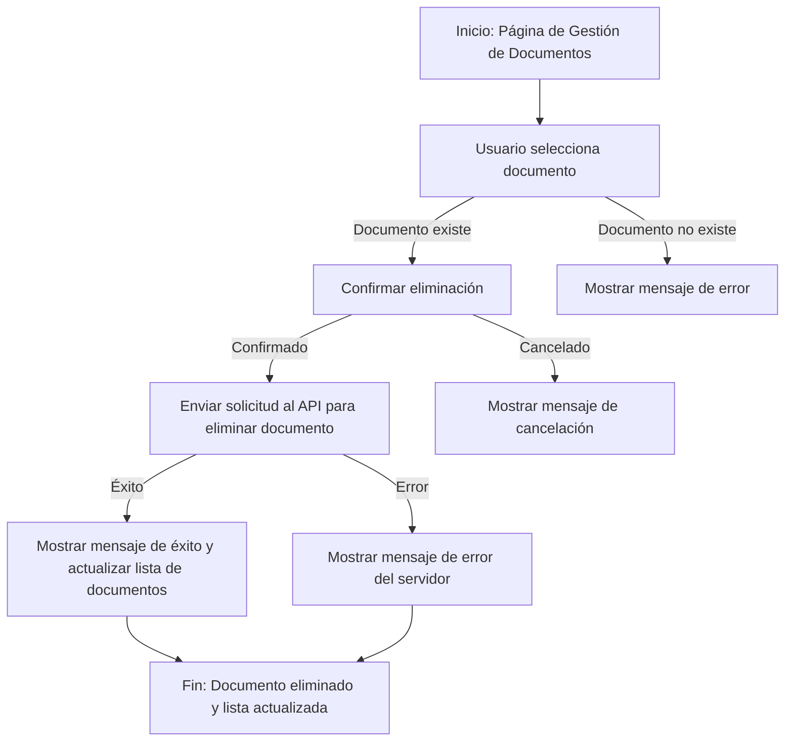
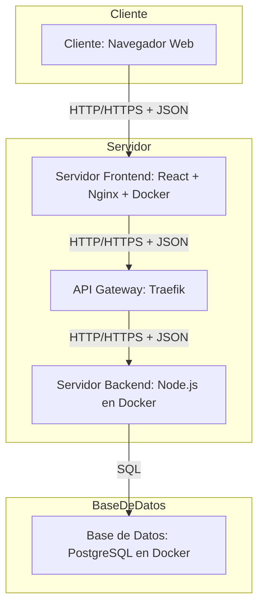

# Diagrama de Flujo para la inicialización de sesión

1. **Inicio**: El usuario accede a la página de inicio de sesión.
2. **Ingreso de credenciales**:
   -El usuario ingresa su correo y contraseña.
   -Si las credenciales son inválidas (por ejemplo, campos vacíos o formato incorrecto), se muestra un mensaje de error.
3. **Envío de credenciales**:
   -Si las credenciales son válidas, se envían al API de inicio de sesión.
   -Si el inicio de sesión es exitoso, se redirige al usuario a la página principal y se almacena el token de sesión.
   -Si ocurre un error en el servidor (por ejemplo, credenciales incorrectas), se muestra un mensaje de error.
4. **Fin**: El flujo termina con el usuario autenticado y redirigido a la página principal, o con un mensaje de error mostrado al usuario.

# Diagrama de Flujo de Transferencia

Este diagrama describe el flujo de transferencia de Usuario en el sistema. Representa las interacciones principales entre el usuario, la interfaz de usuario y las APIs involucradas en la gestión de operadores y la transferencia de documentos. A continuación, se detalla cada paso del flujo:

1. **Inicio**: La página `OperadoresPage` se renderiza y se ejecuta el `useEffect` para cargar los datos iniciales desde la API.
2. **Carga de datos iniciales**:
    - Si la carga es exitosa, se actualiza el estado con la lista de operadores obtenida.
    - Si ocurre un error, se muestra un mensaje de error al usuario.
3. **Interacción del usuario**:
    - El usuario puede buscar un operador ingresando un término de búsqueda, que se envía a la API para filtrar los resultados.
    - Si la búsqueda es exitosa, se actualiza el estado con los resultados obtenidos.
    - Si ocurre un error durante la búsqueda, se muestra un mensaje de error.
4. **Transferencia**:
    - El usuario puede iniciar una transferencia seleccionando un operador.
    - Se solicita confirmación al usuario antes de proceder.
    - Si se confirma, se prepara un payload con los datos necesarios y se envía a la API para iniciar la transferencia.
    - Dependiendo del resultado de la API, se muestra un mensaje de éxito o error.

# Diagrama de Flujo de Registro

Este diagrama describe el flujo de registro de un usuario en el sistema. Representa las interacciones principales entre el usuario, la interfaz de usuario y las APIs involucradas en el proceso de registro. A continuación, se detalla cada paso del flujo:

1. **Inicio**: El usuario accede a la página de registro.
2. **Ingreso de datos**:
    - El usuario completa el formulario con información como nombre, correo y contraseña.
    - Si los datos son inválidos (por ejemplo, campos vacíos o formato incorrecto), se muestra un mensaje de error.
3. **Envío al API**:
    - Los datos se envían al API de registro.
    - Si el registro es exitoso, se crea la cuenta y el usuario es redirigido al Dashboard.
    - Si ocurre un error en el servidor (por ejemplo, correo ya registrado), se muestra un mensaje de error.
4. **Autenticación**: Una vez registrado, el usuario queda autenticado en el sistema.

# Diagrama de Flujo de Editar Perfil

Este diagrama describe el flujo de edición del perfil de un usuario en el sistema. Representa las interacciones principales entre el usuario, la interfaz de usuario y las APIs involucradas en el proceso de edición del perfil. A continuación, se detalla cada paso del flujo:

1. **Inicio**: El usuario accede a la página de edición de perfil.
2. **Carga de datos**:
   - Se cargan los datos actuales del perfil desde la API.
   - Si la carga es exitosa, se muestran los datos en el formulario.
   - Si ocurre un error, se muestra un mensaje de error.
   - Si el usuario no está autenticado, se redirige a la página de inicio de sesión.
3. **Interacción del usuario**:
   - El usuario edita los campos del formulario con la información que desea actualizar.
   - Si los datos ingresados son válidos, se envían al API de actualización.
   - Si los datos son inválidos, se muestra un mensaje de error indicando los problemas encontrados.
4. **Actualización del perfil**:
   - Si la API procesa correctamente los datos, el perfil se actualiza y se muestra un mensaje de éxito al usuario.
   - Si ocurre un error en el servidor, se muestra un mensaje de error indicando el problema.
5. **Fin**: El flujo termina con el perfil actualizado o con un mensaje de error mostrado al usuario.

# Diagrama de Flujo Para cargar documentos

1. **Inicio**: El usuario accede a la página de carga de documentos.
2. **Selección de archivo**:
   -El usuario selecciona un archivo desde su dispositivo.
   -Si el archivo seleccionado es inválido (por ejemplo, formato no permitido o archivo vacío), se muestra un mensaje de error.
3. **Envío del archivo**:
   -Si el archivo es válido, se envía al API de carga.
   -Si la carga es exitosa, se muestra un mensaje de éxito y se actualiza la lista de documentos.
   -Si ocurre un error en el servidor durante la carga, se muestra un mensaje de error.
4. **Fin**: El flujo termina con el documento cargado y la lista actualizada, o con un mensaje de error mostrado al usuario.

#diagrama de flujo para eliminar documentos
1. **Inicio**: El usuario accede a la página de gestión de documentos.
2. **Selección de documento**:
   -El usuario selecciona un documento de la lista.
   -Si el documento seleccionado no existe, se muestra un mensaje de error.
3. **Confirmación de eliminación**:
   -El usuario confirma la eliminación del documento.
   -Si el usuario cancela, se muestra un mensaje de cancelación.
4. **Eliminación del documento**:
   -Si el usuario confirma, se envía una solicitud al API para eliminar el documento.
   -Si la eliminación es exitosa, se muestra un mensaje de éxito y se actualiza la lista de documentos.
   -Si ocurre un error en el servidor durante la eliminación, se muestra un mensaje de error.
5. **Fin**: El flujo termina con el documento eliminado y la lista actualizada, o con un mensaje de error mostrado al usuario.

# Diagrama de Flujo para registro de usuario

1. **Inicio**: El usuario accede a la página de registro.
2. **Ingreso de datos**:
   -El usuario completa el formulario con su nombre, correo y contraseña.
   -Si los datos son inválidos (por ejemplo, campos vacíos o formato incorrecto), se muestra un mensaje de error.
3. **Envío de datos**:
   -Si los datos son válidos, se envían al API de registro.
   -Si el registro es exitoso, se redirige al usuario a la página de inicio de sesión.
   -Si ocurre un error en el servidor (por ejemplo, correo ya registrado), se muestra un mensaje de error.
4. **Fin**: El flujo termina con el usuario registrado y redirigido a la página de inicio de sesión, o con un mensaje de error mostrado al usuario.

