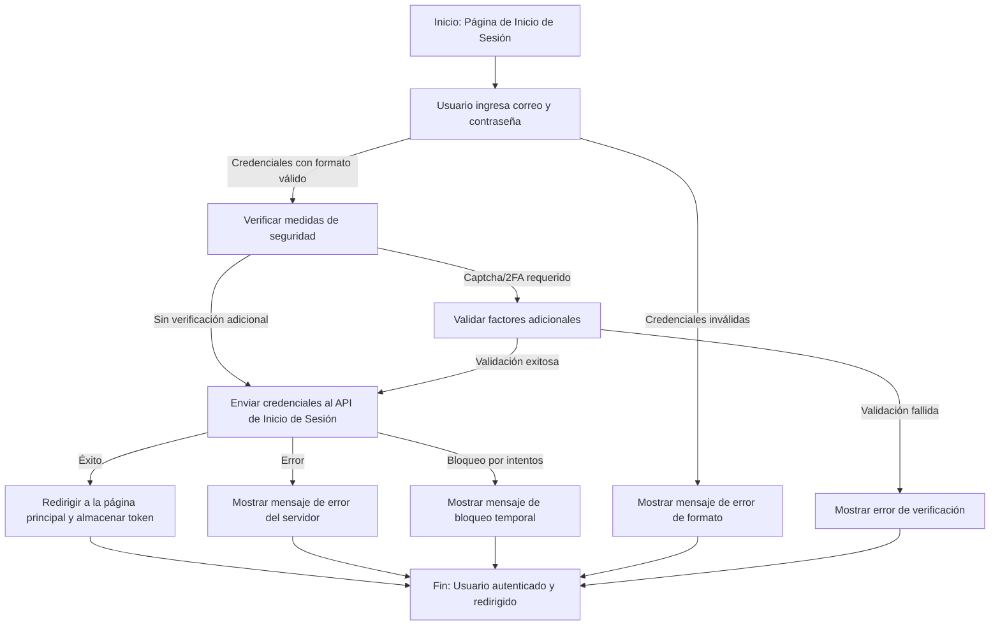
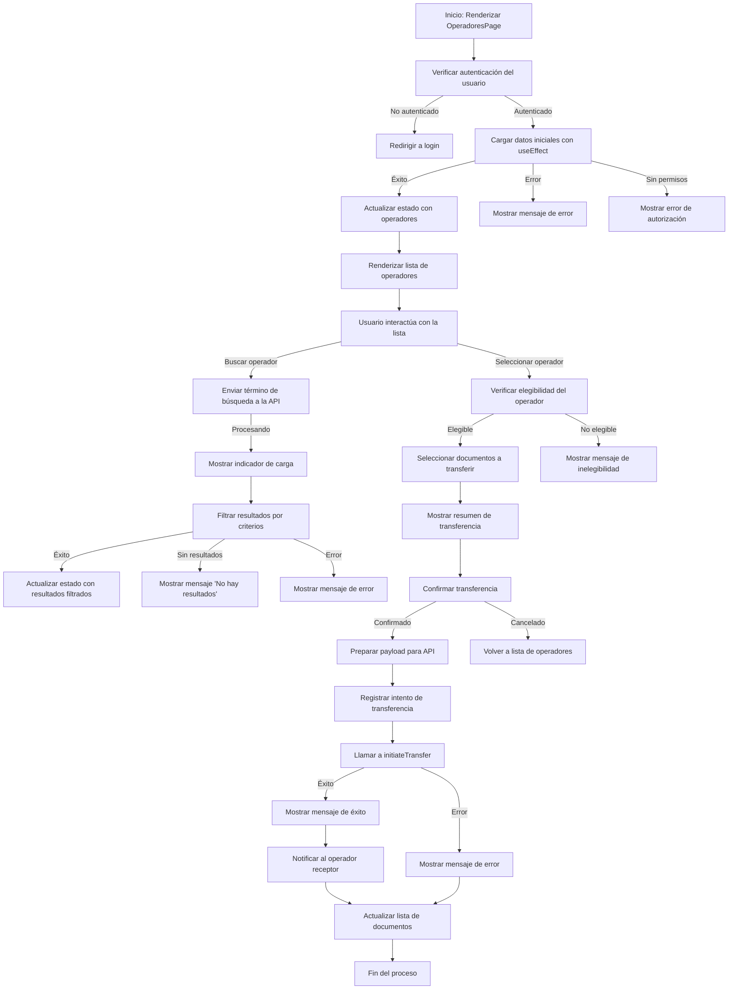

# Diagrama de Flujo para la inicialización de sesión

1. **Inicio**: El usuario accede a la página de inicio de sesión.
2. **Ingreso de credenciales**:
   - El usuario ingresa su correo y contraseña.
   - Si las credenciales son inválidas (por ejemplo, campos vacíos o formato incorrecto), se muestra un mensaje de error.
3. **Validación de seguridad**:
   - Se verifica el uso de captcha o autenticación de dos factores si está habilitado.
   - Se aplican restricciones de intentos fallidos para prevenir ataques de fuerza bruta.
4. **Envío de credenciales**:
   - Si las credenciales son válidas, se envían al API de inicio de sesión.
   - Si el inicio de sesión es exitoso, se redirige al usuario a la página principal y se almacena el token de sesión.
   - Si ocurre un error en el servidor (por ejemplo, credenciales incorrectas), se muestra un mensaje de error.
5. **Fin**: El flujo termina con el usuario autenticado y redirigido a la página principal, o con un mensaje de error mostrado al usuario.

# Diagrama de Flujo de Transferencia

Este diagrama describe el flujo de transferencia de Usuario en el sistema. Representa las interacciones principales entre el usuario, la interfaz de usuario y las APIs involucradas en la gestión de operadores y la transferencia de documentos. A continuación, se detalla cada paso del flujo:

1. **Inicio**: La página `OperadoresPage` se renderiza y se ejecuta el `useEffect` para cargar los datos iniciales desde la API.
2. **Carga de datos iniciales**:
    - Se verifica el estado de autenticación del usuario antes de solicitar datos.
    - Si la carga es exitosa, se actualiza el estado con la lista de operadores obtenida.
    - Si ocurre un error, se muestra un mensaje de error al usuario.
3. **Interacción del usuario**:
    - El usuario puede buscar un operador ingresando un término de búsqueda, que se envía a la API para filtrar los resultados.
    - Los resultados se validan para mostrar solo operadores activos y autorizados.
    - Si la búsqueda es exitosa, se actualiza el estado con los resultados obtenidos.
    - Si ocurre un error durante la búsqueda, se muestra un mensaje de error.
4. **Selección y transferencia**:
    - El usuario selecciona un operador específico de la lista.
    - El sistema valida la elegibilidad del operador para recibir la transferencia.
    - El usuario selecciona los documentos que desea transferir.
    - Se muestra un resumen de la transferencia para confirmación.
5. **Proceso de transferencia**:
    - Se solicita confirmación al usuario antes de proceder.
    - Si se confirma, se prepara un payload con los datos necesarios y se envía a la API para iniciar la transferencia.
    - El sistema registra el intento de transferencia para auditoría.
    - Dependiendo del resultado de la API, se muestra un mensaje de éxito o error.
    - En caso de éxito, se notifica al operador receptor sobre la transferencia pendiente.

