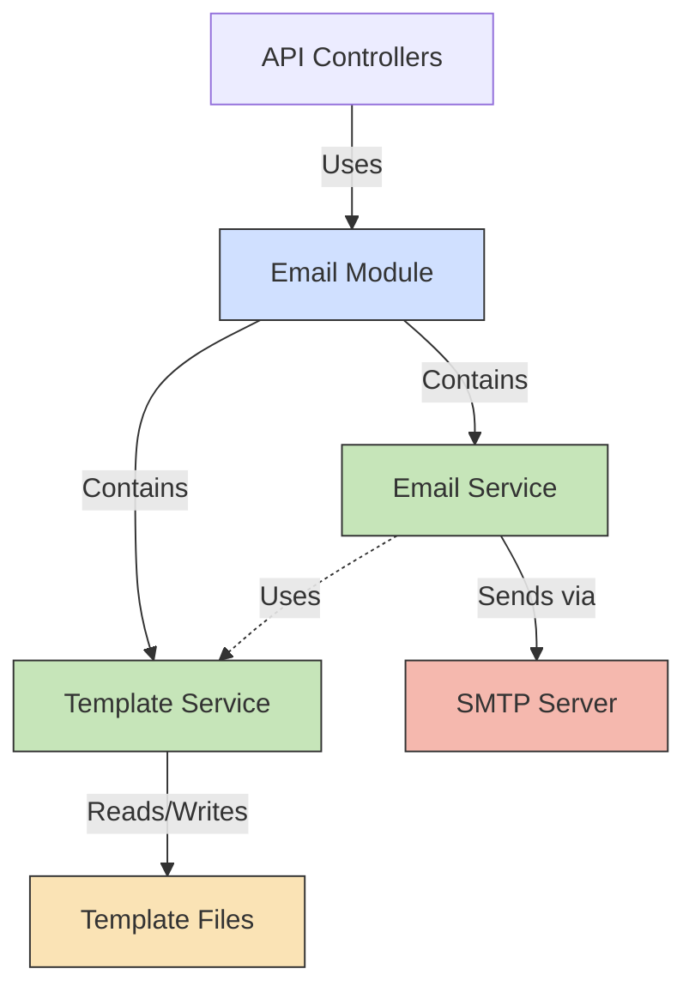

# Email Notification Service

## Context

The Email Notification Service is a component within the DocuCol notifications API responsible for sending transactional emails, notifications, and system-generated communications to users. It provides a reliable and templated approach to email delivery using SMTP.

## Component Diagram



## Components

### Email Module

The Email Module serves as the container for all email-related functionality in the notifications API. It provides:

- Configuration for email services
- Registration of required services
- Controllers for API endpoints
- Integration with the broader application

### Email Service

The Email Service handles the core functionality of sending emails. It:

- Manages the connection to SMTP servers
- Sends emails with proper formatting
- Provides direct email sending capabilities
- Offers template-based email sending
- Handles error management and logging

### Template Service

The Template Service is responsible for email template management. It:

- Loads templates from the filesystem
- Compiles templates with variable substitution using Handlebars
- Provides template storage and retrieval
- Supports both HTML and plain text email formats

## Interfaces

### Email Service API

| Method | Description | Parameters | Return Type |
|--------|-------------|------------|-------------|
| sendEmail | Sends an email with direct content | SendEmailDto | Promise<any> |
| sendTemplateEmail | Sends an email using a template | templateName, to, context, options | Promise<any> |
| verifyConnection | Verifies the SMTP connection | - | Promise<boolean> |

### Template Service API

| Method | Description | Parameters | Return Type |
|--------|-------------|------------|-------------|
| getTemplate | Gets a template by name | name | EmailTemplate \| null |
| compileTemplate | Compiles a template with context | name, context | Promise<EmailTemplate \| null> |
| saveTemplate | Saves a template | template | Promise<boolean> |
| deleteTemplate | Deletes a template | name | Promise<boolean> |

### REST API Endpoints

| Endpoint | Method | Description | Request Body | Response |
|----------|--------|-------------|-------------|----------|
| /email/send | POST | Send a direct email | SendEmailDto | Success message with messageId |
| /email/send-template | POST | Send a template email | TemplateEmailDto | Success message with messageId |
| /email/templates | GET | List all templates | - | Array of template metadata |
| /email/templates/:name | GET | Get template details | - | Template data |
| /email/templates/:name | DELETE | Delete a template | - | Success message |

## Data Models

### SendEmailDto

```typescript
interface SendEmailDto {
  from?: string;
  to: string | string[];
  cc?: string | string[];
  bcc?: string | string[];
  subject: string;
  text?: string;
  html?: string;
  attachments?: Array<{
    filename: string;
    content: Buffer | string;
    contentType?: string;
  }>;
}
```

### TemplateEmailDto

```typescript
interface TemplateEmailDto {
  templateName: string;
  to: string | string[];
  from?: string;
  cc?: string | string[];
  bcc?: string | string[];
  context: Record<string, any>;
  attachments?: Array<{
    filename: string;
    content: Buffer | string;
    contentType?: string;
  }>;
}
```

### EmailTemplate

```typescript
interface EmailTemplate {
  name: string;
  subject: string;
  htmlContent: string;
  textContent?: string;
}
```

## Email Template Structure

Templates are stored on the filesystem using the following structure:

```
templates/
  emails/
    template-name/
      subject.txt    # Subject line template
      html.hbs       # HTML content template
      text.hbs       # Plain text content template
```

Each template is stored in its own directory with separate files for subject, HTML content, and plain text content. Templates use Handlebars syntax for variable interpolation.

## Configuration

The email service is configured via environment variables:

| Variable | Description | Default |
|----------|-------------|---------|
| SMTP_HOST | SMTP server hostname | - |
| SMTP_PORT | SMTP server port | 587 |
| SMTP_SECURE | Whether to use TLS | false |
| SMTP_USER | Username for SMTP auth | - |
| SMTP_PASSWORD | Password for SMTP auth | - |
| SMTP_DEFAULT_FROM | Default sender address | - |
| SMTP_REJECT_UNAUTHORIZED | Reject unauthorized TLS | true |
| EMAIL_TEMPLATE_DIR | Directory for email templates | ./templates/emails |

## Architecture Decisions

### ADR-001: Use of NestJS for Email Service

**Context**: Need to implement an email service within the microservices architecture.

**Decision**: Use NestJS framework for the email service implementation.

**Consequences**: 
- Benefits from NestJS dependency injection
- Consistent with other microservices
- Provides structured approach to modules and services
- Easy integration with configuration and logging systems

### ADR-002: File-based Template Storage

**Context**: Need to store and manage email templates.

**Decision**: Use filesystem-based storage for email templates with a directory structure.

**Consequences**:
- Simple implementation without database dependency
- Templates can be version-controlled with the codebase
- Easy to update through file operations
- Directory-based organization provides clarity
- Limited scalability for very large numbers of templates

### ADR-003: Handlebars for Template Rendering

**Context**: Need a templating system for emails that supports variable interpolation.

**Decision**: Use Handlebars for template rendering.

**Consequences**:
- Well-established templating library
- Good balance of features and simplicity
- Support for partials, helpers, and conditionals
- Familiar syntax for developers
- Secure by default with proper escaping

## Testing Guidelines

1. **Unit Testing**:
   - Mock the nodemailer transport to test email formatting
   - Test template rendering with various contexts
   - Verify error handling for failed sends

2. **Integration Testing**:
   - Use a test SMTP server (like Ethereal) for end-to-end testing
   - Verify templates are loaded correctly from the filesystem
   - Test the complete flow from API endpoint to email delivery

3. **Security Testing**:
   - Verify input sanitization to prevent template injection
   - Test with invalid SMTP credentials to ensure proper error handling
   - Verify authentication requirements for API endpoints

## Security Considerations

1. SMTP credentials are stored as environment variables
2. API endpoints are protected by JWT authentication
3. Input validation is applied to all API requests
4. Template rendering escapes variables to prevent XSS
5. TLS verification is configurable but enabled by default

## Monitoring and Logging

1. All email sending attempts are logged
2. SMTP connection errors are reported
3. Template loading and compilation issues are logged
4. Each email send operation logs success or failure
5. API endpoints include appropriate response status codes

## Future Improvements

1. **Email Queue Implementation**:
   - Add a message queue for email delivery
   - Implement retry mechanism for failed sends
   - Provide delayed sending capabilities

2. **Enhanced Template Management**:
   - Web-based template editor
   - Template versioning and rollbacks
   - A/B testing support

3. **Analytics and Reporting**:
   - Track email opens and clicks
   - Generate reports on email delivery success rates
   - Monitor bounces and email deliverability
